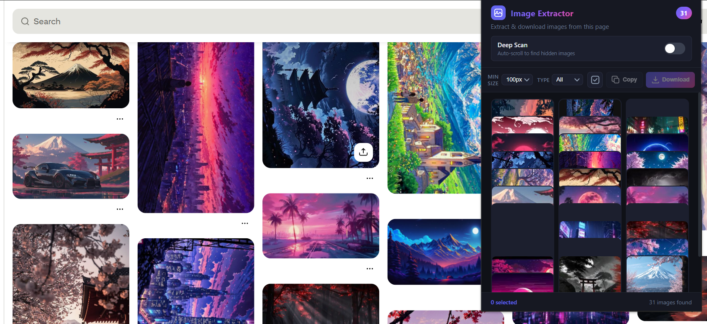
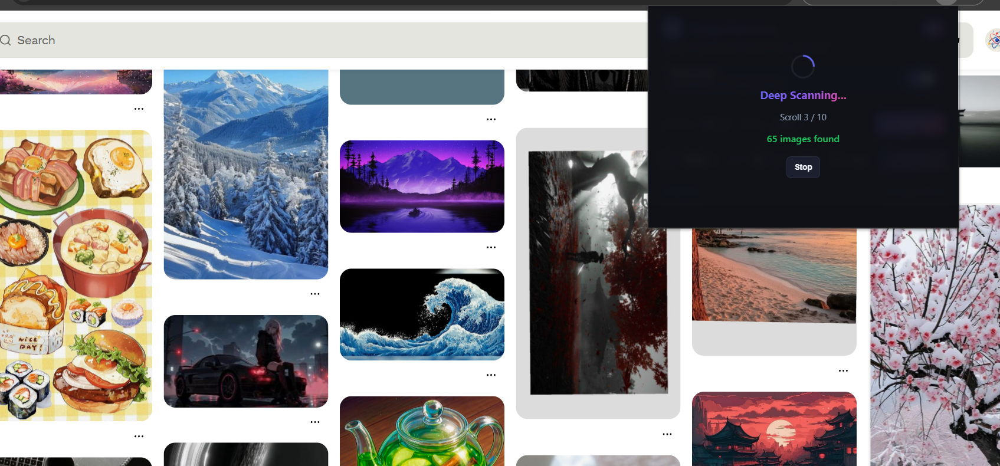
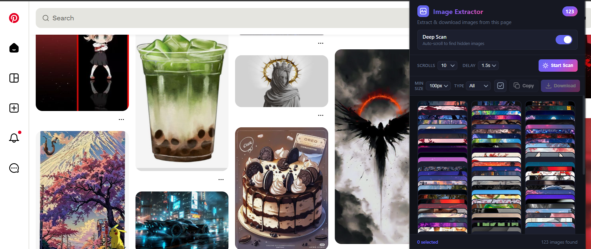

# Image Extractor Pro

A powerful and lightweight Google Chrome extension designed to extract, filter, and download images from any webpage. It identifies not only standard HTML images but also those embedded in CSS backgrounds, responsive picture tags, video posters, and inline SVGs.

## Deep Scan (Auto-Scroll)

Extract images from infinite-scroll and virtual DOM pages (like Pinterest, Facebook, or Twitter).

1. Toggle **Deep Scan** to the ON position.
2. Configure **Scrolls** (how deep to scan) and **Delay** (time to wait for lazy-loading).
3. Click **Start Scan** and watch the magic happen!

## Features

- **Deep Scan (Auto-Scroll)**: A toggleable mode to automatically scroll and meticulously extract images from infinite-scroll and virtual DOM pages (like Pinterest or Twitter). Features a configurable scroll count and delay.
- **Comprehensive Extraction**: Captures images from `` tags, CSS backgrounds, `<picture>` elements, `<video>` posters, and inline SVGs.
- **Smart Filtering**: Filter extracted images by minimum pixel width or specific file types (JPG, PNG, GIF, WebP, SVG).
- **Batch Processing**: Select multiple images to download all at once or copy their URLs to the clipboard.
- **Clipboard Integration**: Instantly copy individual image files directly to your system clipboard (or fallback to URL copy if cross-origin restrictions apply).
- **Clean UI**: Modern, dark-themed popup interface with hardware-accelerated animations and glassmorphism elements.

## Installation

This extension is currently intended for developer installation (sideloading). Follow these steps to install it directly from the source code:

1. Download or clone this repository to your local machine.
2. Open Google Chrome and navigate to `chrome://extensions/`.
3. Enable the **Developer mode** toggle in the top right corner.
4. Click the **Load unpacked** button in the top left corner.
5. Select the directory containing the extension files.

The extension will now appear in your Chrome toolbar. We recommend pinning it for easy access.

## Usage

1. Navigate to any webpage containing images you wish to extract.
2. Click the Image Extractor Pro icon in the Chrome toolbar.
3. The extension will automatically scan and display all available images on the page.
4. Use the dropdown filters at the top to narrow down results by minimum size or file type.
5. Hover over any image card to:
   - Click the **Copy** button to copy the raw image data to your clipboard.
   - Click the **Download** button to save that specific image.
6. Click directly on image cards to select them.
7. Use the bottom toolbar to **Copy URLs** or **Download** the current selection in batch.

## Permissions Required

The extension requires the following permissions in `manifest.json` to function correctly:

- `activeTab`: Necessary to inject the extraction script into the currently active webpage and retrieve the image URLs.
- `downloads`: Necessary to save images directly to your local file system without prompting for a save location each time.

## Architecture

- `manifest.json`: Manifest V3 configuration defining extension metadata and permissions.
- `content.js`: Injected script that parses the DOM and computed styles to locate all visual assets.
- `background.js`: Service worker responsible for handling the Chrome Downloads API.
- `popup.html/js/css`: The user interface and interaction logic.

## License

This project is open-source and available under the [MIT License](LICENSE).
